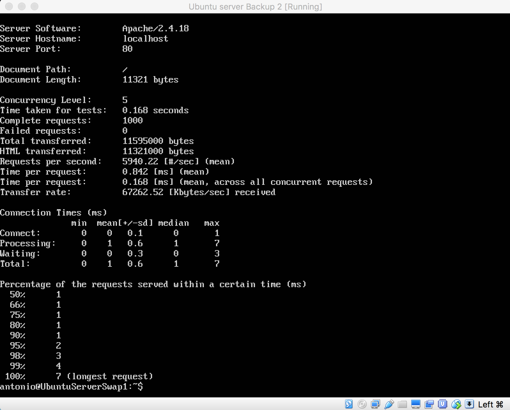

# Ejercicios Tema 2 #

## Ejercicio 1 ##
### Calcular la disponibilidad del sistema si tenemos dos réplicas de cada elemento (en total 3 elementos en cada subsistema). ###

##### Disponibilidad inicial #####

| Componente | Disponibilidad |
|:-------------|:-----------------|
| web | 85% |
| aplicación | 90% |
| Base de datos | 99.9% |
| DNS | 98% |
| Firewall | 85% |
| Switch | 99% |
| Data Center | 99.99% |
| ISP | 95% |

##### Con dos elementos en cada subsistema #####

| Componente | Disponibilidad |
|:-------------|:-----------------|
| web | 97.75% |
| aplicación | 99% |
| Base de datos | 99.9999% |
| DNS | 98% |
| Firewall | 97.75% |
| Switch | 99.99% |
| Data center | 99.99% |
| ISP | 99.75% |

##### Con tres elementos en cada subsistema #####

Para obtener el porcentaje de disponibilidad, he usado la fórmula **A = Ac(n-1) + ( (1 - Ac(n-1)) * Ac(n) )**.

A continuación muestro la tabla de disponibilidad actualizada:

| Componente | Disponibilidad |
|:-----------|:---------------|
| web | 99.66% |
| aplicación | 99.9% |
| Base de datos | 99.9999% |
| DNS | 99.99996% |
| Firewall | 99.66% |
| Switch | 99.9999% |
| Data center | 99.999999% |
| ISP | 99.9875% |

El total de disponibilidad se obtiene al multiplicar todos los porcentajes de la última tabla es **99.2092%** de disponibilidad.

## Ejercicio 2 ##

### Buscar frameworks y librerías para diferentes lenguajes que permiten hacer aplicaciones altamente disponibles con relativa facilidad. ###

- **Python**: Uno de los frameworks más usados para desarrollo web es [*Django*](https://www.djangoproject.com). Otro framework usado es [*flask*](http://flask.pocoo.org), que permite un desarrollo minimalista para tener lo necesario para tener disponible una página web.
- **Javascript**: Una de las librerías más usadas es [*jQuery.js*](https://jquery.com), que ofrece una gran variedad de funciones para el desarrollo ágil de nuestra aplicación. Como framework MVC tenemos [*Angular.js*](https://angularjs.org), desarrollado por Google, que trabaja del lado del cliente y nos permite hacer más dinámica nuestra aplicación web.
- **Ruby**: El framework más famoso de Ruby es [*Ruby on rails*](http://rubyonrails.org) que permite un desarrollo ágil de páginas web.
- **Php**: [*Symfony*](http://symfony.es) es uno de los frameworks más usados para php. Pone en práctica el patrón modelo vista controlador.

## Ejercicio 3 ##

  
### ¿Cómo analizar el nivel de carga de cada uno de los subsistemas en el servidor? ###

Para analizar el nivel de carga de Apache podemos usar el benchmark **ab** (Apache Bench) [enlace](https://httpd.apache.org/docs/2.4/programs/ab.html). En mi caso voy a realizar una prueba sobre una máquina virtual que tiene instalado Apache, indicando el número de peticiones que quiero realizar y el número de peticiones concurrentes. El comando es el siguiente

    ab -n 1000 -c 5 http://ip:puerto/

- **-n** indica el número de peticiones.
- **-c** las peticiones concurrentes.
- **ip** la dirección ip sobre la que se quiere realizar el test. En mi caso sería localhost o 10.0.2.15.
- **puerto** el puerto por donde responde apache (80).

Como podemos ver al terminar el test, nos muestra información por pantalla: La versión de apache, la dirección, la cantidad de bytes del documento, el nivel de concurrencia, el tiempo del test, etc.

## Ejercicio 4 ##

### Buscar ejemplos de balanceadores software y hardware (productor comerciales). ###

Un balanceador por software lo podemos conseguir con un router cisco, tal y como explica este [enlace](http://www.cisco.com/c/es_mx/support/docs/ip/border-gateway-protocol-bgp/5212-46.html).

Balanceador por hardware también nos lo proporciona cisco [cisco](http://www.cisco.com/c/en/us/products/application-networking-services/ace-4710-application-control-engine/index.html).

### Buscar productos comerciales para servidores de aplicaciones. ###

[Oracle WebLogic](http://www.oracle.com/technetwork/middleware/weblogic/overview/index-085209.html) es un servidor de aplicación Java EE.

### Buscar productos comerciales para servidores de almacenamiento. ###

[Servidores de almacenamiento de Dell](http://www.dell.com/es/empresas/p/storage-products) ofrece una gama de productos para almacenamiento de datos.
