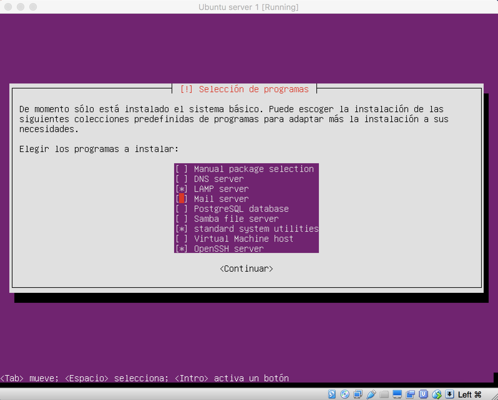
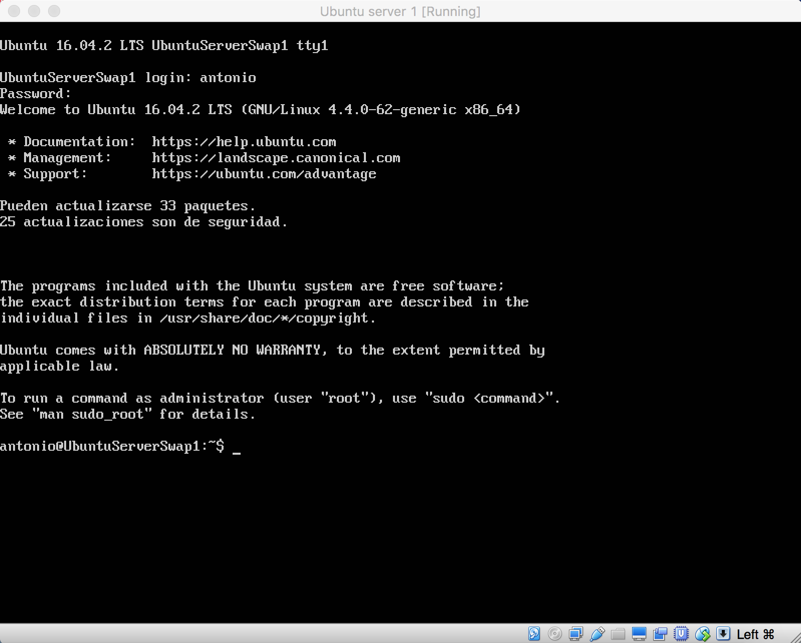

## Práctica 1 ##

Para esta primera práctica tengo que instalar Ubuntu server, Apache y ssh en VirtualBox.

En esta primera captura muestro la instalación de LAMP (Linux + Apache + MySql + PHP) y de openSSH.

En esta segunda captura muestro la entrada a la terminal de Ubuntu Server, con el servidor ya instalado.

