## Práctica 2 Clonar la información de un sitio web. ##

Antes de copiar archivos de una máquina a otra, primero tengo que crear la máquina sustituta, ya que en la práctica anterior únicamente creé una máquina virtual.

Para obtener la máquina sustituta o de reserva, utilizamos la opción clonar sobre la máquina principal.

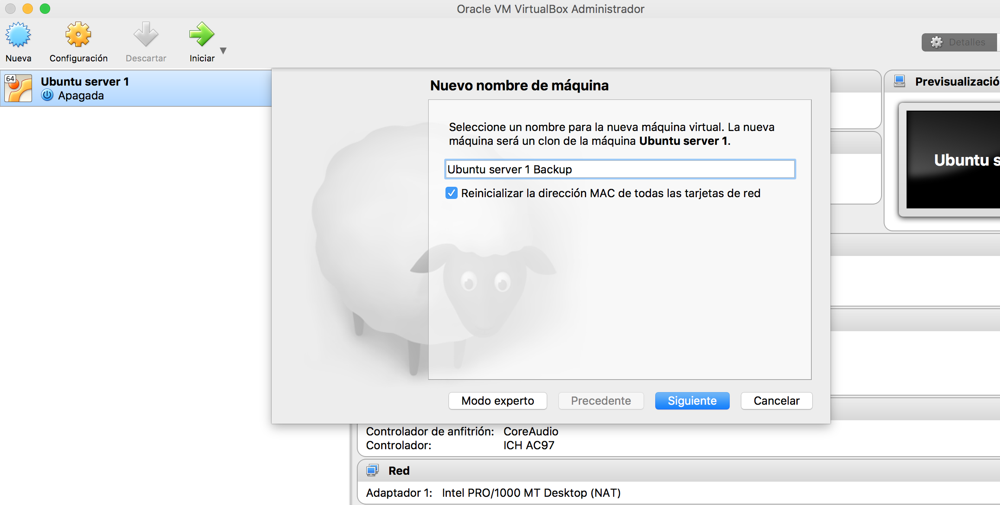

El siguiente paso es seleccionar que quiero **Clonación completa**.

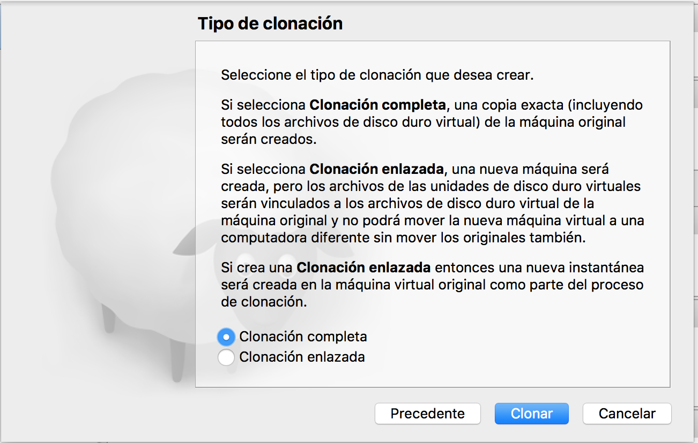

Podemos ver el resultado de la clonación

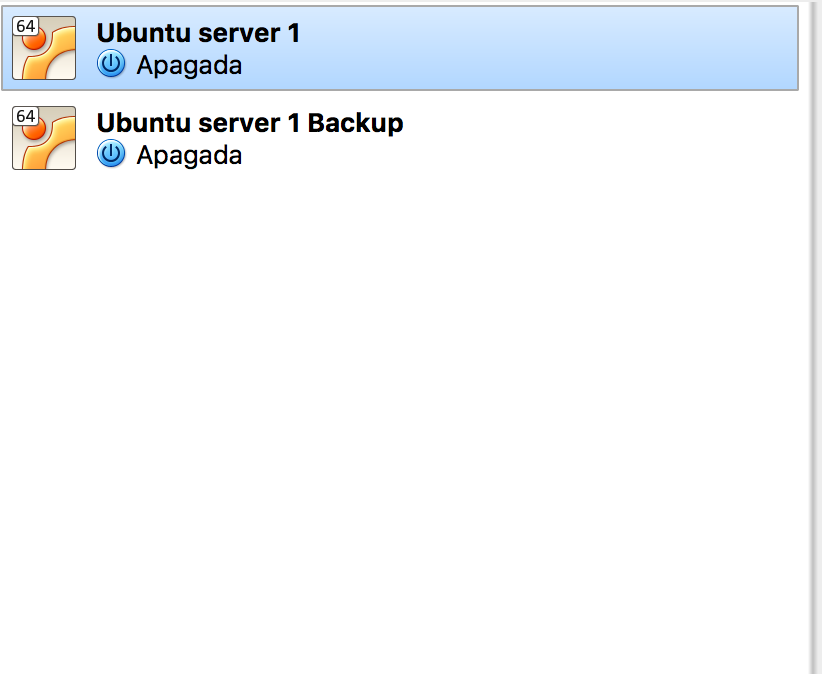

#### Configuración ssh ####

El primer paso que voy a realizar es configurar ssh para poder conectarme como root de una máquina a otra. El archivo de configuración de ssh se encuentra en la ruta **/etc/ssh/sshd_config**.

Lo primero que he hecho es cambiar el valor **PermitRootLogin** a yes.

    PermitRootLogin yes

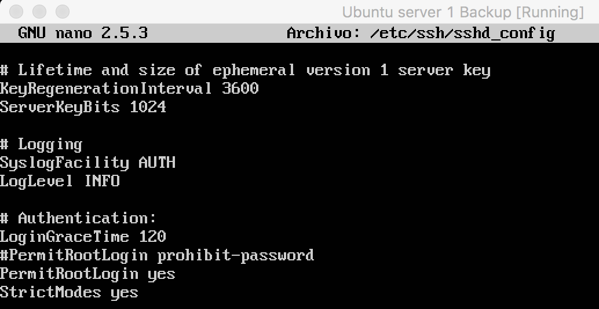

Reinicio el servicio con el comando

    sudo service ssh restart

Este proceso lo he hecho en las dos máquinas.

El siguiente paso en generar las claves pública y privada de las máquina secundaria para acceder a la máquina principal.

Con la orden

    ssh-keygen -t rsa

genero el par de claves, pulsando enter dejando todos los espacios en blanco.

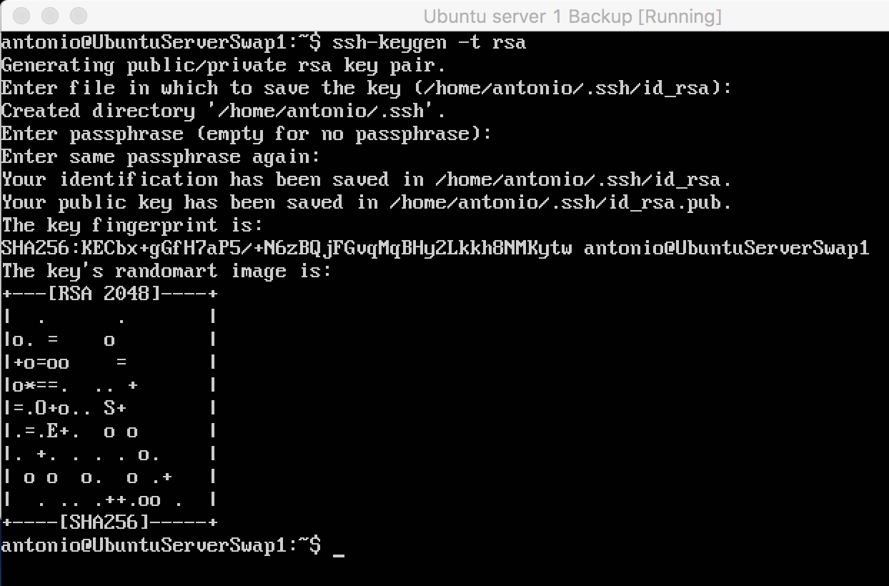

Para obtener la IP de la máquina principal, en la propia máquina principal ponemos el comando

    ifconfig -a

Y nos muestra la ip de la interfaz que le asigné en el apartado 1: **10.10.10.16**.

Para enviar la clave pública desde la máquina secundaria a la principal insertamos este comando:

    ssh-copy-id -i .ssh/id_dsa.pub antonio@10.10.10.16

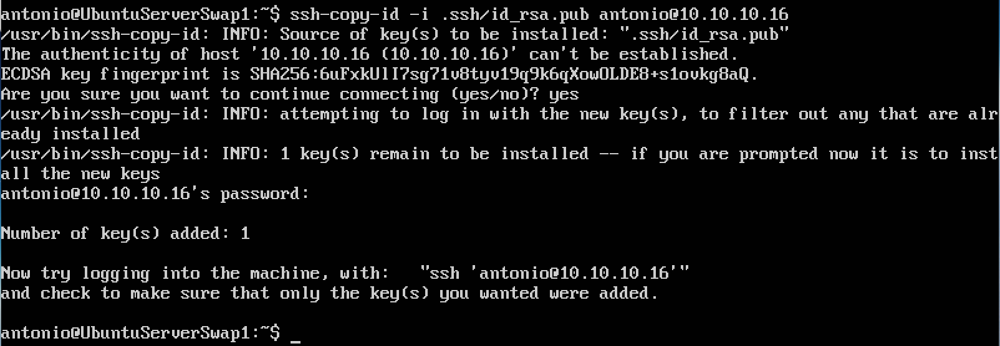

A continuación damos permisos 600 a la carpeta **authorized_keys** en la máquina principal.

    chmod 600 authorized_keys

Para acceder por ssh desde la máquina secundaria a la primera introducimos:

    ssh 10.10.10.16

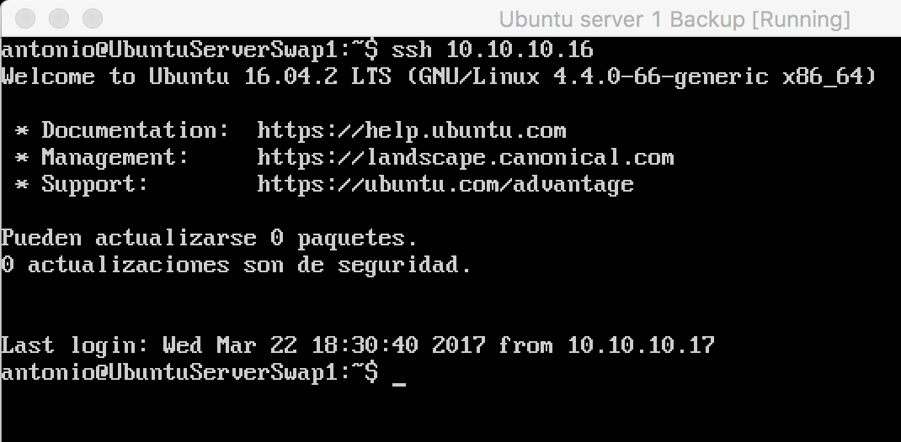

Hacemos el mismo proceso de la máquina principal a la máquina secundaria.

#### Crear un tar con ficheros locales en un equipo remoto. ####

Lo primero que he hecho como directorio de prueba para el envío a la máquina principal ha sido crear un directorio llamado **prueba** y un fichero dentro de este llamado **prueba.txt**.

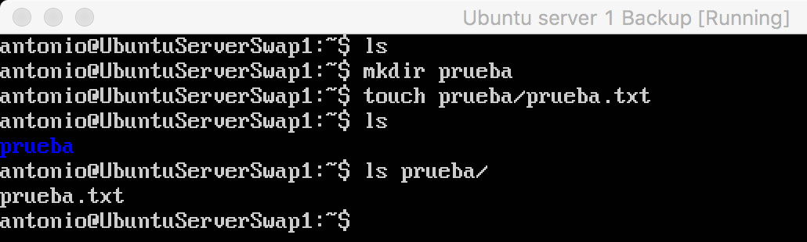

Ahora le enviamos al equipo destino (máquina principal) el directorio comprimido.

    tar czf - prueba | ssh 10.10.10.16 'cat > ~/tar.tgz'

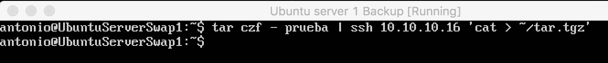

Comprobamos en la máquina principal que el directorio ha sido recibido comprimido.

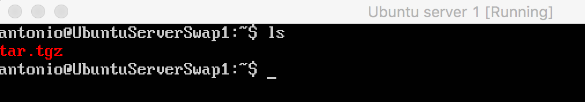

#### Instalar la herramiento rsync ####

Para poder realizar una copia de la carpeta **/var/www/** de la máquina 1 a la máquina 2, he tenido que crear una clave ssh para root en la máquina 2 y enviársela a la máquina 1, ya que me daba problemas de permisos (la carpeta /var/www/ solo tiene permisos de superusuario) y no podía hacer la copia.

El proceso ha sido el siguiente:

    sudo su

Introduzco la clave y ya estoy como **root**. A continuación genero la clave con

    ssh-keygen -t rsa

Esta clave se genera en **/root/.ssh/**. El siguiente paso es enviarla a la máquina 1 con este comando:

    ssh-copy-id -i /root/.ssh/id_dsa.pub antonio@10.10.10.16

Introduzco la clave; aquí termina el proceso.

Para instalar la herramienta **rsync** introducimos este comando:

    sudo apt install -y rsync

En mi caso ya la tenía instalada

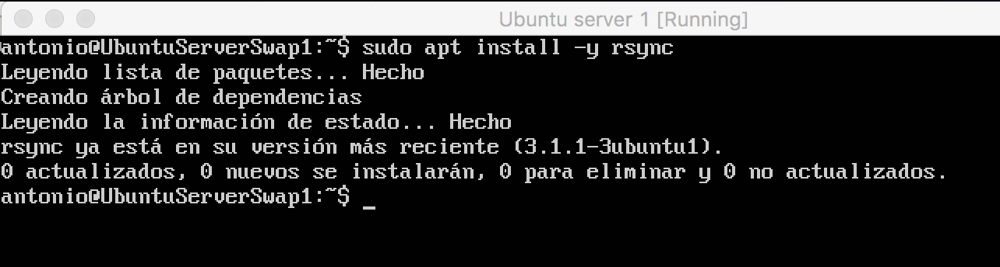

A continuación he clonado la carpeta con el contenido del servidor web de la máquina secundaria a la máquina principal.

    rsync -avz -e ssh antonio@10.10.10.16:/var/www/ /var/www/

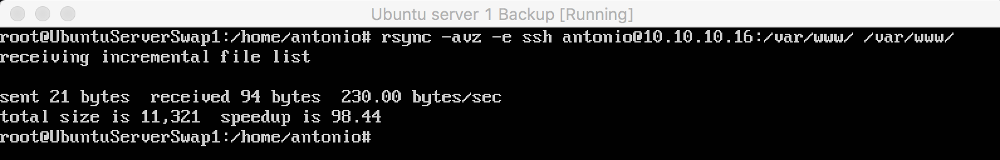

#### Programar tareas con crontab ####

Para programar tareas con crontab accedemos al archivo **/etc/crontab**. En mi caso he escrito que se realice la tarea cada minuto del día usando el comando anterior de rsync.

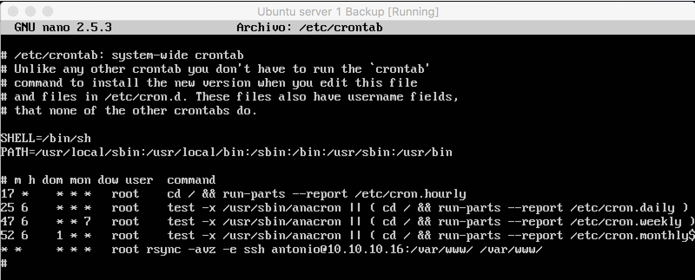

Me he creado un fichero **prueba.txt** en la carpeta **/var/www/** de la máquina 1 para que sea más visual la realización de la tarea.

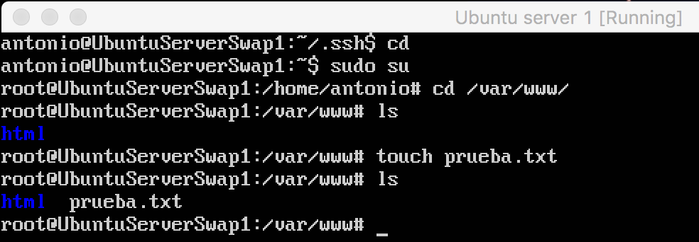

A continuación muestro con ls dentro de la carpeta **/var/www** como actualiza la carpeta. Primero muestro que solo hay un directorio **html**, después con otro ls podemos ver que llega el archivo **prueba.txt**

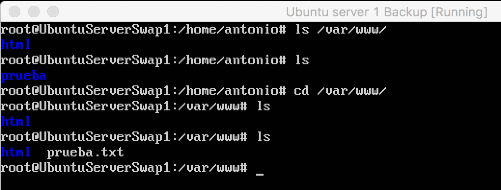
