## Práctica 3 Balanceo de carga ##

### NGINX ###

Para esta tercera práctica me he creado una tercera máquina llamada **balanceador**. Por defecto no le he instalado LAMP que me lo da como opción durante la instalación (con esto quiero decir que en esta máquina virtual no tengo instalado el servicio apache).

Para la instalación de **nginx** se debe de utilizar estos comandos:

    sudo apt update && sudo apt dist-upgrade -y && sudo apt autoremove -y
    sudo apt install -y nginx

Nginx por defecto funciona como servidor web. Para cambiar su funcionalidad seguimos estos pasos:

1. Borramos todo el contenido del archivo **/etc/nginx/conf.d/default.conf**. Aunque en mi caso el directorio **conf.d** está vacío.
2. Cuando creamos el archivo **default.conf**, introducimos el contenido mostrado en la siguiente imagen:
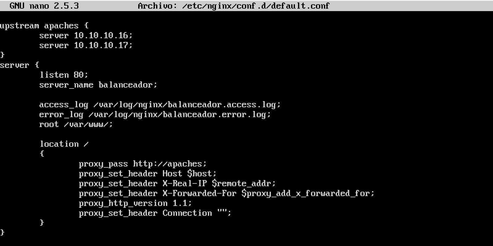
Como podemos observar las dos máquinas a las que se redirige el tráfico son la **10.10.10.16** y **10.10.10.17**.
3. A continuación reiniciamos el servicio con el comando
    sudo service nginx restart
4. Si no muestra ningún error quiere decir que hemos hecho las cosas correctamente. Para comprobar si el balanceador redirige el tráfico debemos de hacer peticiones a la IP donde se encuentra el balanceador. En mi caso la ip es **10.10.10.18**. Para saber si nginx está funcionando para el propósito, he cambiado el contenido de la página por defecto que sirve cada apache (antes de cambiar el contenido del index.html primero hay que desactivar la copia que usábamos en la práctica 2). El contenido de la página que sirve apache de la máquina 1 es el siguiente:

El contenido de la máquina 2 es:

Por último, desde una cuarta máquina vamos a realizar las peticiones de la siguiente forma:

    curl http://10.10.10.18

Podemos ver que hace el balanceo correctamente con la siguiente captura
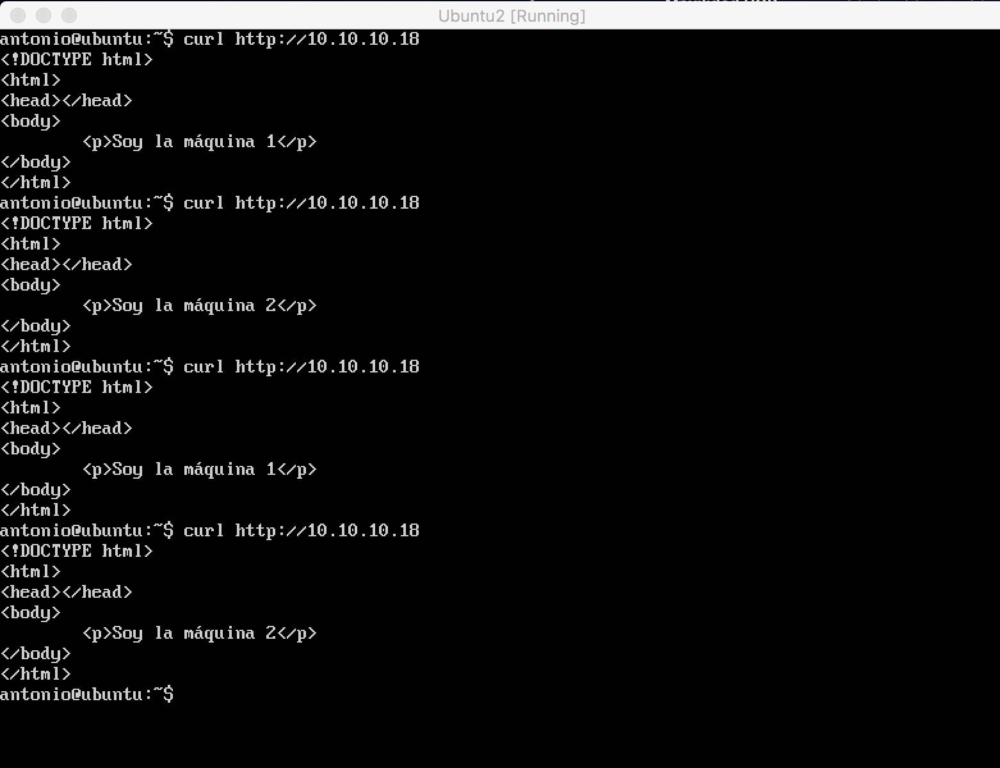

Siguiendo el guión de la práctica, supongamos que el segundo servidor es más potente que el otro, podemos indicarle al balanceador que por cada 3 peticiones, 2 se las de a la máquina 2 y 1 petición a la máquina 1.

Reiniciamos el servicio:
    sudo service nginx restart

Y realizamos las peticiones

    curl http://10.10.10.18

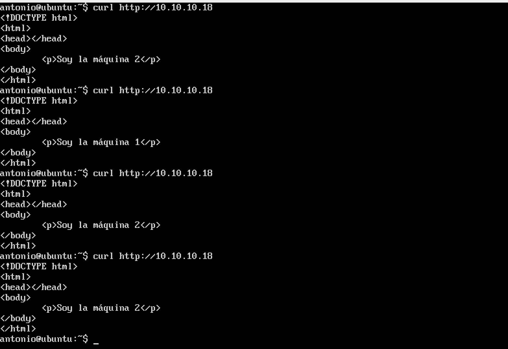

También podemos hacer un balanceo por ip, de forma que todo el tráfico que venga de una ip se sirva durante toda la sesión por el mismo servidor final. Para ello usamos la directiva **ip_hash**.
El contenido de upstream es el siguiente:

    upstream apaches {
      ip_hash;
      server 10.10.10.16;
      server 10.10.10.17;
    }
Volvemos a reiniciar el servicio. Vemos que nginx sirve de la misma máquina en la siguiente captura:
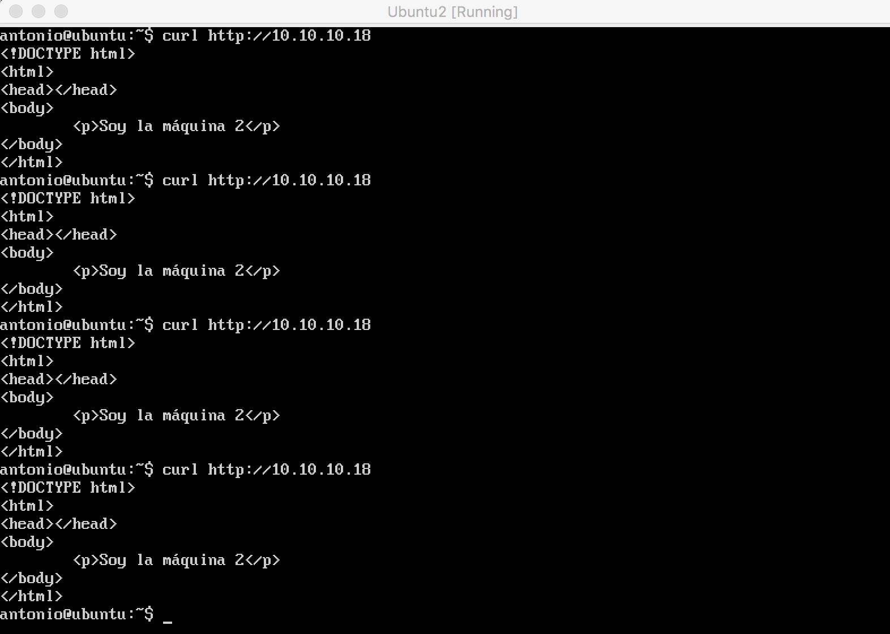

Otra opción que nos permite **Nginx** es usar la directiva **keepalive**, modificamos upstream añadiendo **keepalive** y un mantenimiento de la conexión en segundos.

    upstream apaches {
      server 10.10.10.16;
      server 10.10.10.17;
      keepalive 5;
    }

Esto permite que se realice una conexión con una persistencia de múltiples peticiones HTTP en lugar de abrir una conexión nueva cada vez.

### HAPROXY ###

Antes de empezar a trabajar con Haproxy **desactivamos** Nginx.

    sudo service nginx stop

Para instalar **Haproxy**:

    sudo apt update
    sudo apt install -y haproxy

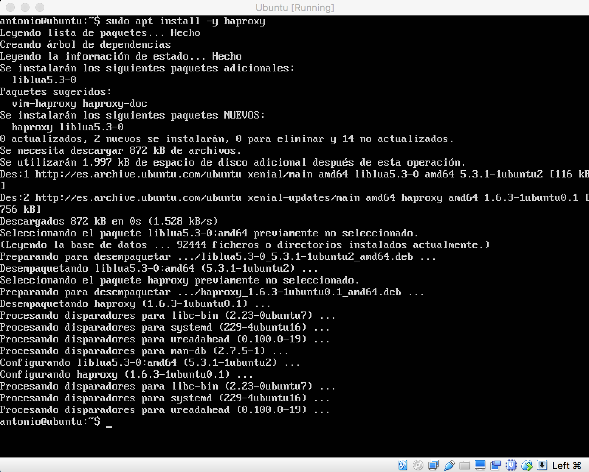

#### Configuración básica de Haproxy ####

El archivo de configuración de Haproxy se encuentra en **/etc/haproxy/haproxy.cfg**.
Lo primero he hecho una copia del archivo de configuración:

    cd /etc/haproxy/
    sudo cp haproxy.cfg ./haproxy.cfg.backup

El siguiente paso es modificar el archivo haproxy.cfg con este contenido:

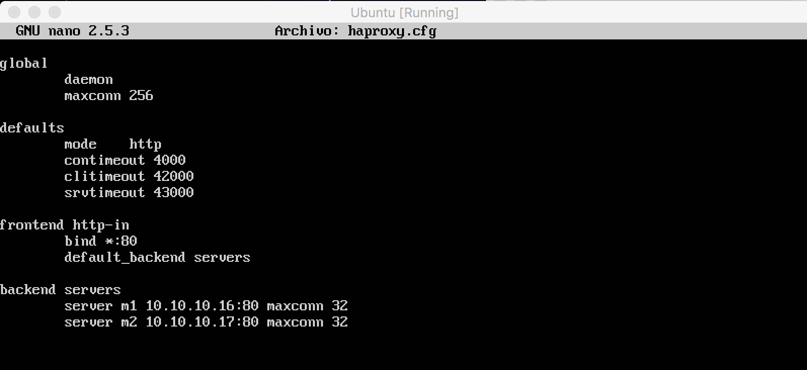

Guardamos y reiniciamos el servicio:

    sudo service haproxy restart

Podemos ver que funciona desde otra máquina realizando una petición con el comando curl y la ip de la máquina **balanceadora**.

    curl 10.10.10.18

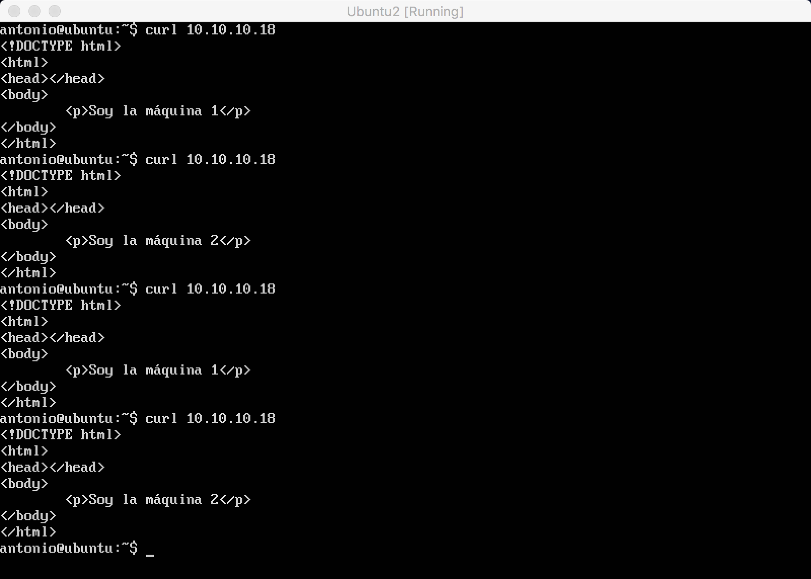

Siguiendo la última indicación del pdf aparece estos warning:

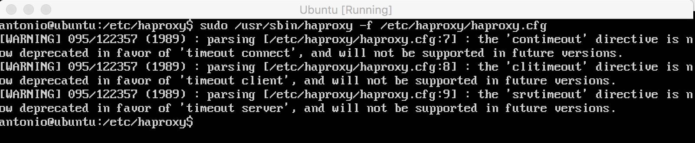

Para solucionar estos warning cambios estas tres lineas:

    contimeout 4000
    clitimeout 42000
    srvtimeout 43000

Por estas tres:

Y como podemos comprobar, ya no nos da error:

### Someter a una alta carga el servidor balanceado ###

Para medir el rendimiento de un servidor necesitaremos una herramienta que ejecutar en los clientes para crear una carga HTTP específica. En este caso he usado la herramienta **Apache Benchmark** ([enlace](http://httpd.apache.org/docs/2.2/programs/ab.html)).

Primero necesitamos instalar Apache Benchamark, para ello:

    sudo apt update
    sudo apt install -y apache2

Junto a apache2, ya tenemos instalado ab (Apache Benchmark). El siguiente paso es realizar el benchmark sobre la máquina balanceadora (**10.10.10.18**) usando el servicio **Nginx**:

    ab -n 10000 -c 100 http://10.10.10.18/

Con esto indicamos que se hagan 10000 peticiones de 100 en 100 de forma concurrente. Los resultados obtenidos los podemos ver en la siguiente captura:

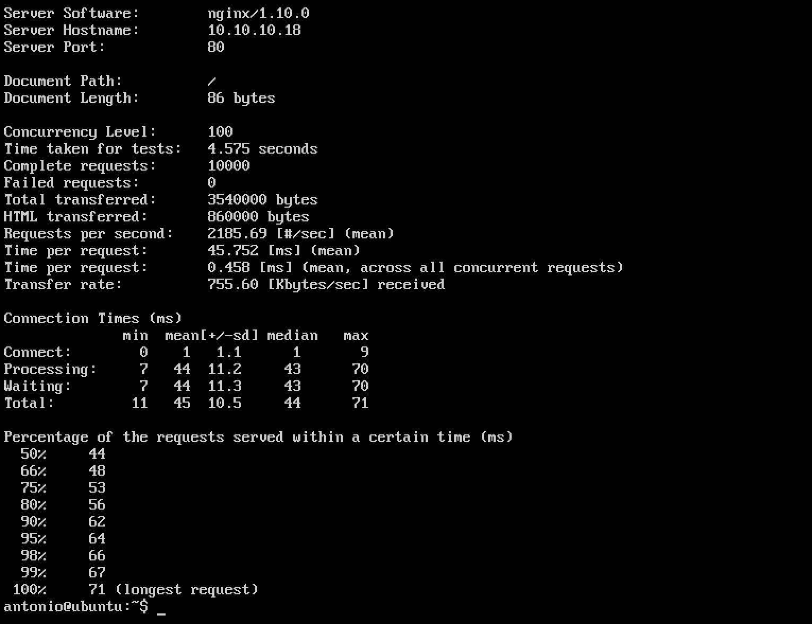

He vuelto a realizar la prubera pero esta vez sin concurrencia:

    ab -n 10000 http://10.10.10.18/

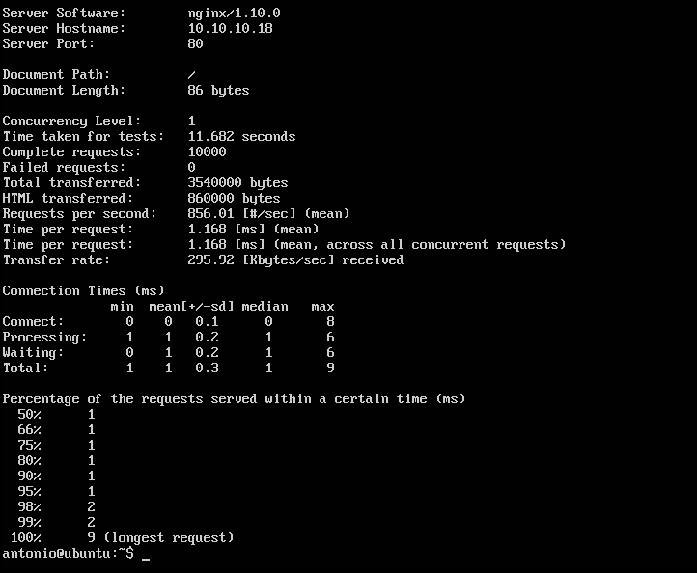

El próximo paso es realizar el test contra el servicio **Haproxy** en la máquina balanceadora, para ello realizamos los dos test que he utilizado anteriormente:

    ab -n 10000 -c 100 http://10.10.10.18/

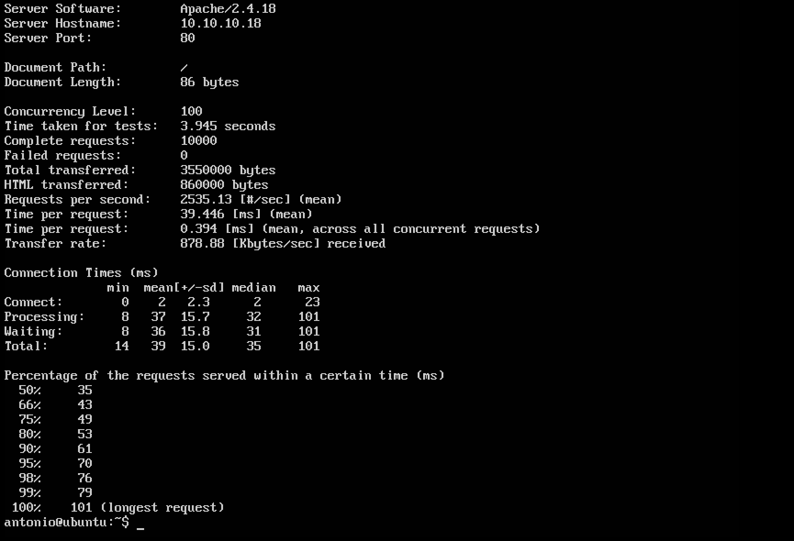

    ab -n 10000 http://10.10.10.18/

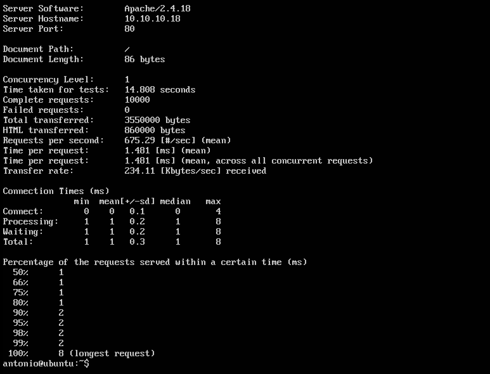
