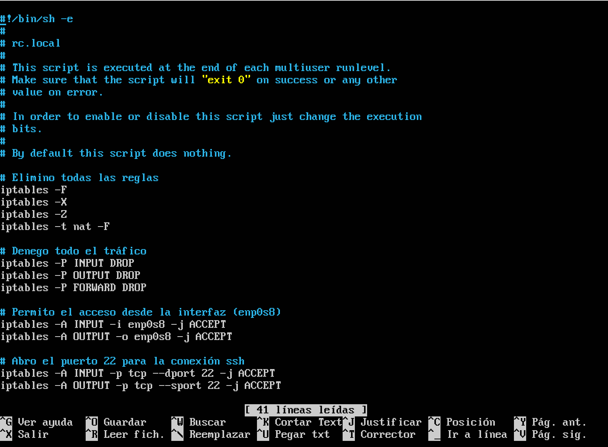
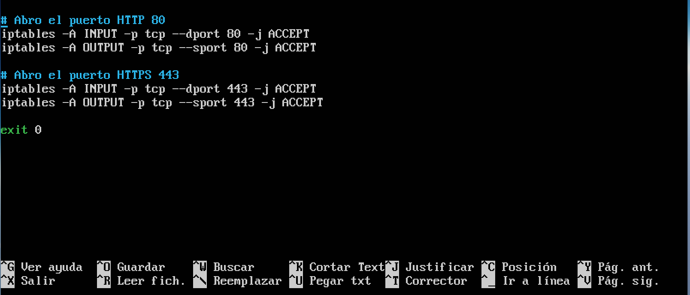
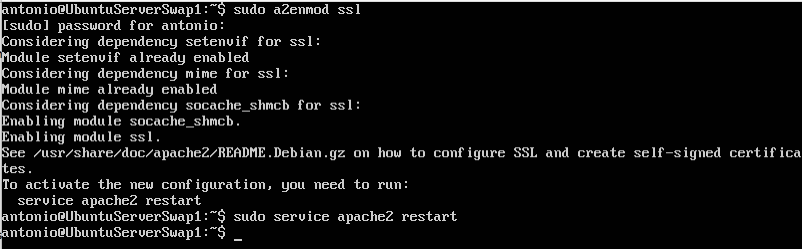
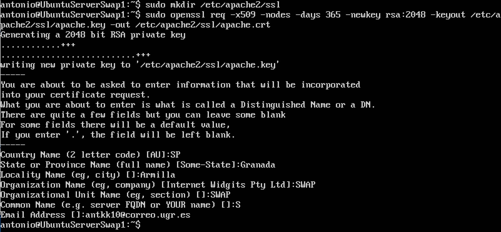
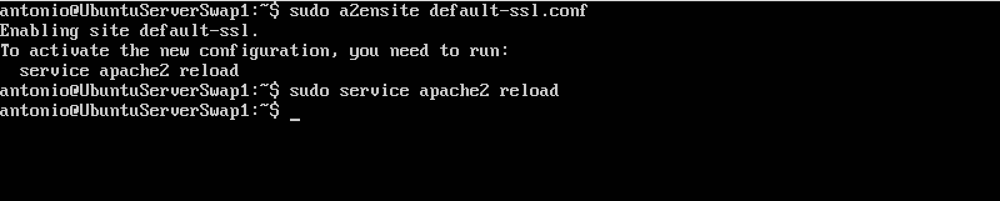
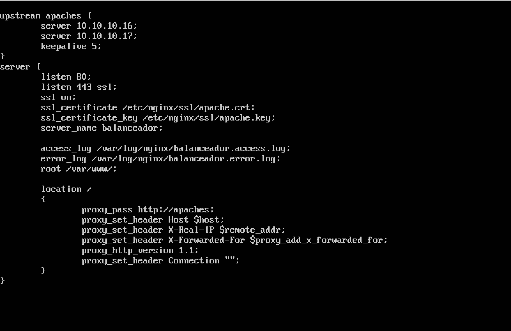
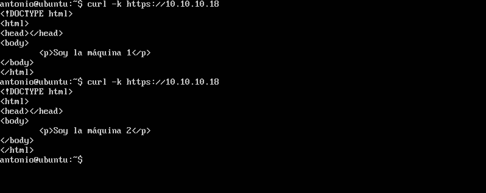

## Práctica 4. Asegurar la granja web ##

#### Objetivos: ####
- Instalar un certificado SSL para configurar el acceso https a los servidores.
- Configurar las reglas del cortafuegos para proteger la granja web.

### Configuración del cortafuegos ###

Configuro las reglas del cortafuegos usando **iptables**. Esta configuración la he hecho en la máquina
balanceadora. La definición de todas las reglas las he hecho en un script en el archivo **/etc/rc.local**.

Lo primero que he hecho ha sido copiar y renombrar el archivo **rc.local** con el nombre **rc.local.backup**.

    sudo cp rc.local rc.local.backup

He definido reglas para permitir acceso por la interfaz, apertura del puerto 22 (ssh), puerto 80 y 443 (para HTTP y HTTPS). La interfaz de mi máquina balanceadora es **enp0s8**.

### Instalar un certificado SSL autofirmado para configurar el acceso por HTTPS ###

He seguidos los pasos indicados en el pdf de la práctica.

Activo el módulo ssl de Apache2 en las dos máquinas virtuales.

    sudo a2enmod ssl
    sudo service apache2 restart

Genero los certificados y indico la ruta a los certificados en la configuración.

    sudo mkdir /etc/apache2/ssl
    sudo openssl req -x509 -nodes -days 365 -newkey rsa:2048 -keyout /etc/apache2/ssl/apache.key -out /etc/apache2/ssl/apache.crt

Nos pide una serie de datos tal y como se muestra en la captura.

Edito el archivo de configuración

    sudo nano /etc/apache2/sites-available/default-ssl.conf

y añadimos dos lineas en **SSLEngine on**

    SSLCertificateFile /etc/apache2/ssl/apache.crt
    SSLCertificateKeyFile /etc/apache2/ssl/apache.key

tal y como muestra la captura

Activamos el sitio default-ssl

    sudo a2ensite default-ssl.conf
    sudo service apache2 reload

Para que la otra máquina y la balanceadora tenga el certificado, accedo por sftp desde la máquina donde generé el certificado y introduzco este comando para la otra máquia:

    sftp put /etc/apache2/ssl/apache.* /etc/apache2/ssl

Y para la máquina balanceador he creado una carpeta en **/etc/nginx/ssl_certificados**.

    sftp put /etc/nginx/ssl/apache.* /etc/nginx/ssl/

La configuración de la máquina balanceador quedaría así:

Después de reiniciar la máquina balanceador, desde el terminal externo a la granja web introducimos:

    curl -k https://10.10.10.18

Y como podemos ver en la captura, nos devuelve la petición:

