## Práctica 5: Replicación de bases de datos MySql. ##

### Crear una DB e insertar datos. ###

En esta sección voy a crear una base de datos con MySql tal y como viene descrito en el guión de la práctica.

Primero compruebo si está instalado MySql:

    mysql --version

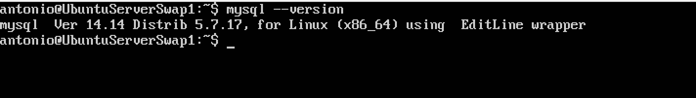

A continuación accedo en modo administrador:

    mysql -uroot -p

y introduzco la clave.

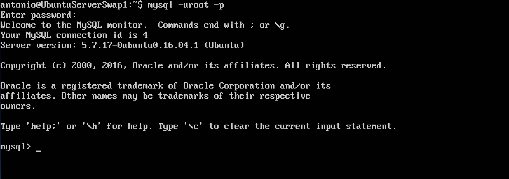

Creo la base de datos

    create database contactos;
    use contactos;

a continuación creo la tabla dentro de la base de datos. Esta tabla se llamara **datos**.

    create table datos(nombre varchar(100), tlf int);

El proceso de creación de la base de datos, con la tabla lo podemos ver en la siguiente captura.

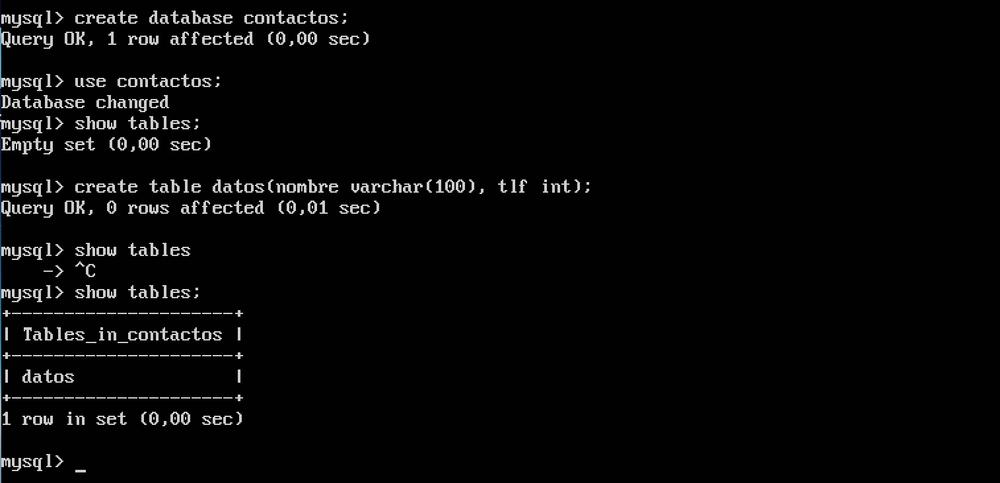

Ahora inserto dos filas en la tabla creada.

    insert into datos(nombre, tlf) values ("Antonio", 656444333);
    insert into datos(nombre, tlf) values ("Pepe", 777665544);

Para consultar los datos insertados en la tabla:

    select * from datos;

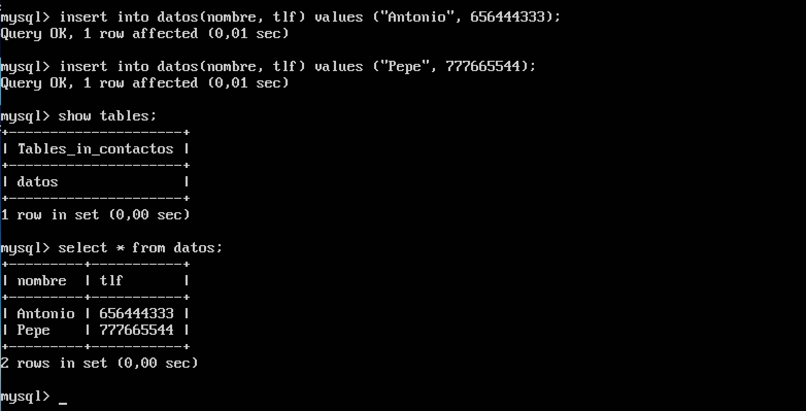

Podemos obtener más información con

    describe datos;

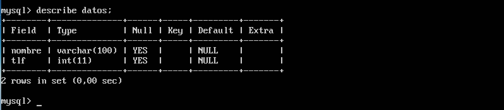

Con esto termino el punto 1.

### Replicar una BD MySql con mysqldump. ###

Para replicar una base de datos del servidor 1 al servidor 2 he utilizado el comando **mysqldump**. Podemos ver las bases de datos creadas en el servidor 1 con el comando:

    show databases;

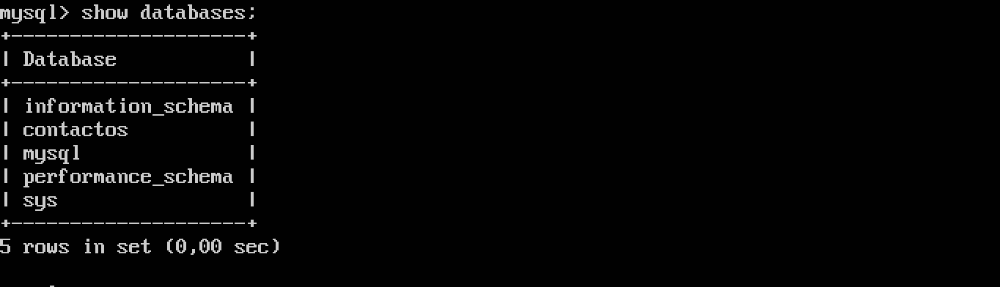

Como vemos ya tenemos la base de datos creada y se llama **contactos**. El siguiente paso es detener el acceso a la base de datos mientras se hace la réplica de la BD, esto lo hago para evitar que se cambien cosas de la BD mientras transcurre la copia. El comando que realiza esta acción es el siguiente:

    FLUSH TABLES WITH READ LOCK;

Para hacer la transferencia al servidor 2, primero debemos crear la base de datos con el mismo nombre en el mismo servidor.

    mysql -u root -p
    create database contactos;

Una vez que hemos creado la base de datos en el servidor 2, desde el servidor 1 primero hacemos una copia del contenido en un fichero **.sql**.

    sudo mysqldump contactos -u root -p > /tmp/contactos.sql

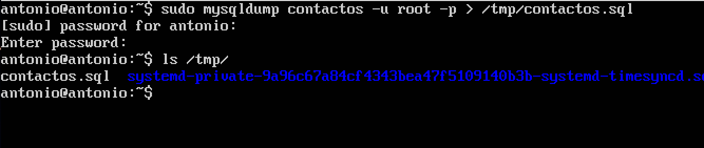

Ahora desbloque la base de datos en el servidor 1 antes de pasar a la siguiente acción.

    mysql -u root -p
    UNLOCK TABLES;

El siguiente paso es ir a la máquina 2 y copiar el archivo creado en la máquina 1.

    scp 10.10.10.16:/tmp/contactos.sql /tmp/

Como he creado la base de datos en un paso anterior, ahora solo falta volcar el contenido de **contactos.sql** en la base de datos.

    mysql -u root -p contactos < /tmp/contactos.sql

Estos dos pasos los podemos ver en la siguiente captura:

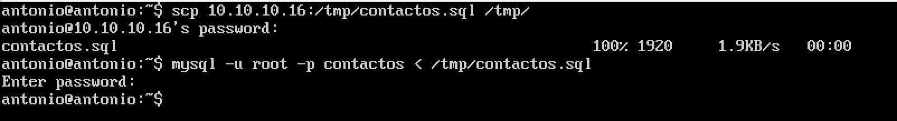

Con este sencillo proceso ya hemos conseguido una réplica de la base de datos.

### Replicación de BD mediante una configuración maestro-esclavo. ###

Para automatizar el proceso de réplica de base de datos, utilizo el denomino de MySql. Con este proceso el administrador de un sistema no tiene que preocuparse por la replica de datos del servidor maestro al esclavo.

Primero he configurado mysql del **maestro**.

    sudo nano /etc/mysql/mysql.conf.d/mysqld.cnf

Y realizo estos cambios:

- Comento bind-address 127.0.0.1, que sirve para la escucha a un servidor.
- Indico donde almacena los errores, **log_error = /var/log/mysql/error.log**.
- El indicador del servidor a 1, **server-id = 1**
- El registro binario contiene  información que está disponible en el registro de actualizaciones, **log_bin = /var/log/mysql/mysql-bin.log**

Por último reiniciamos el servicio para que los datos tengan efecto.

    sudo /etc/init.d/mysql restart

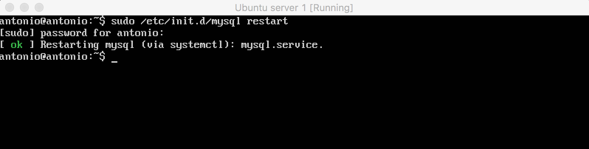

Ahora paso a hacer la configuración del esclavo (servidor 2). Es la misma que en la configuración del servidor 1, con la diferencia de que **server-id = 2**. Al reiniciar mysql podemos ver el ok.

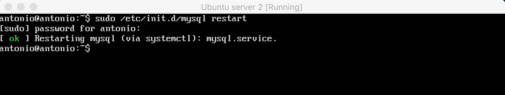

Ahora vuelvo al maestro (servidor 1), creo un usuario y le doy permiso para la replicación.

    mysql -u root -p
    CREATE USER esclavo IDENTIFIED BY 'esclavo';
    GRANT REPLICATION SLAVE ON *.* TO 'esclavo'@'%' IDENTIFIED BY 'esclavo';
    FLUSH PRIVILEGES;
    FLUSH TABLES;
    FLUSH TABLES WITH READ LOCK;

Para obtener los datos de la BD que vamos a replicar:

    SHOW MASTER STATUS;

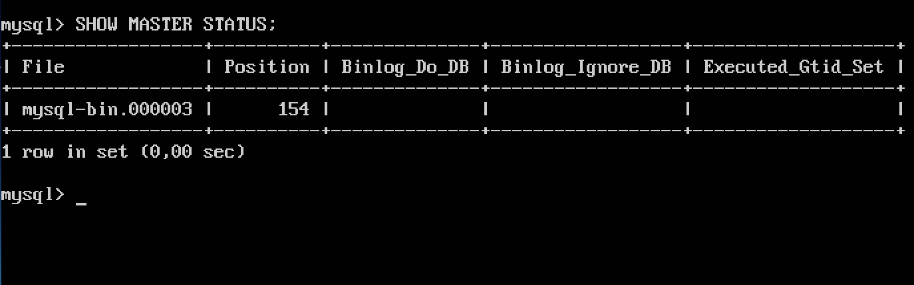

Ahora en el servidor 2 (slave) introducimos los datos del master en el terminal.

    CHANGE MASTER TO MASTER_HOST='10.10.10.16', MASTER_USER='esclavo', MASTER_PASSWORD='esclavo', MASTER_LOG_FILE='mysql-bin.000003', MASTER_LOG_POS=154, MASTER_PORT=3306;

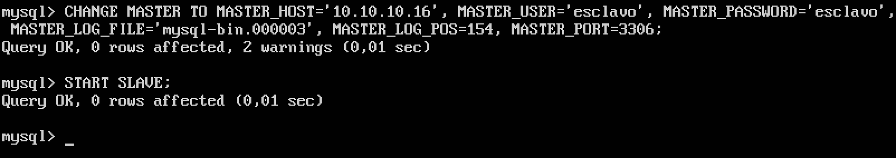

Ahora arrancamos el esclavo en la máquina 2:

    START SLAVE;

y desbloqueamos las tablas en el maestro:

    UNLOCK TABLES;

Comprobamos que todo funciona correctamente con:

    SHOW SLAVE STATUS\G;

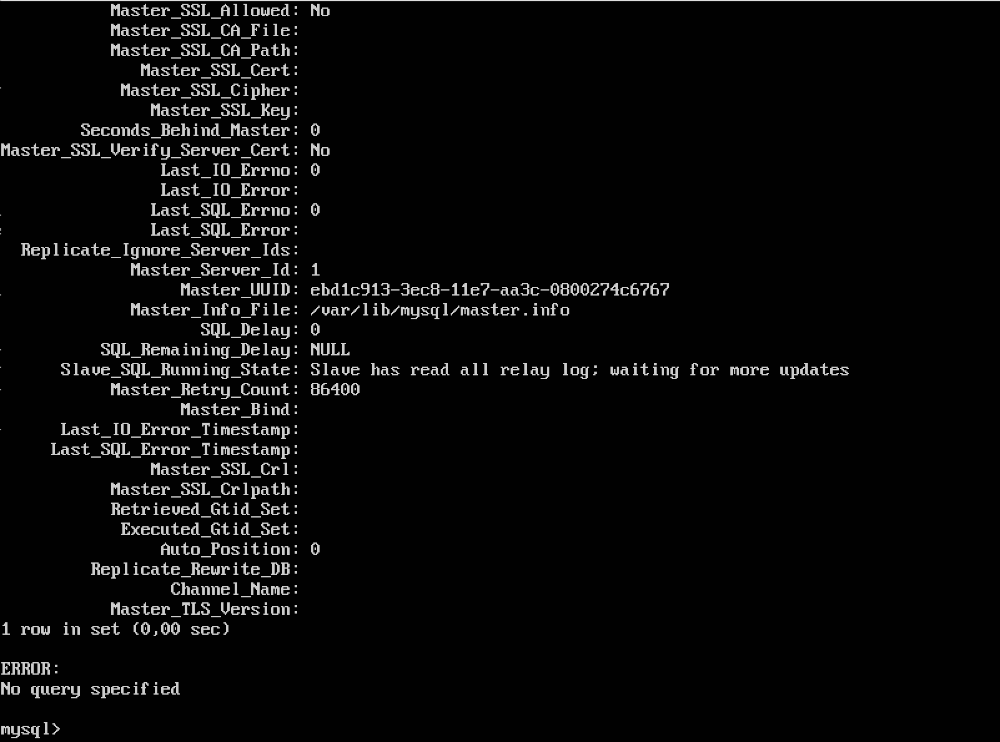

Ahora vamos a insertar una fila en el maestro y veremos como se replica en el esclavo. El contenido del esclavo es el siguiete:

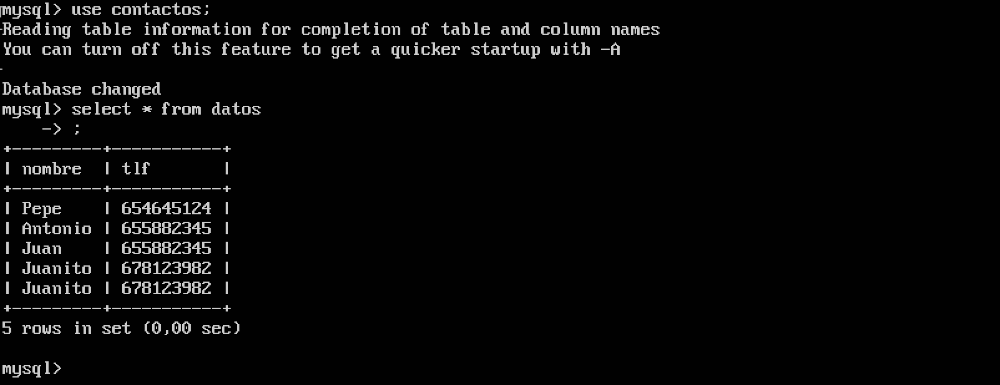

Insertamos una nueva fila en el maestro:

    insert into datos(nombre, tlf) values("Pedro", 666777883)

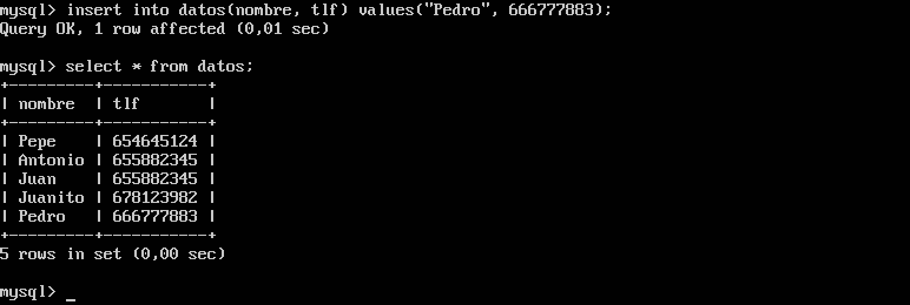

Comprobamos que el dato ha sido replicado en el esclavo:

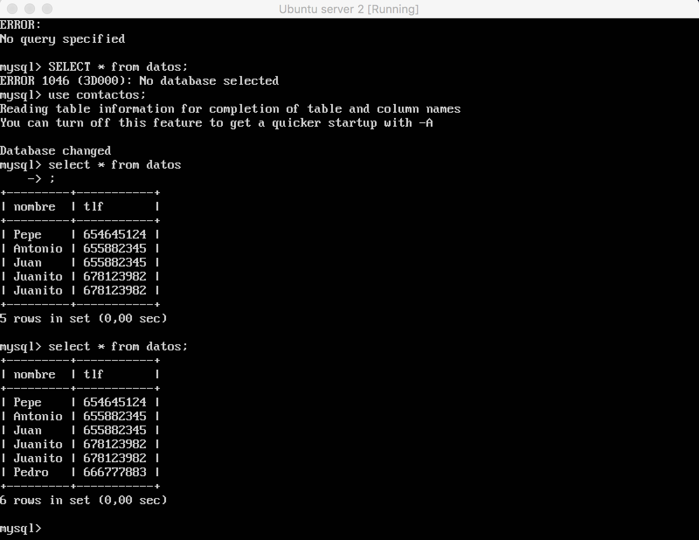
