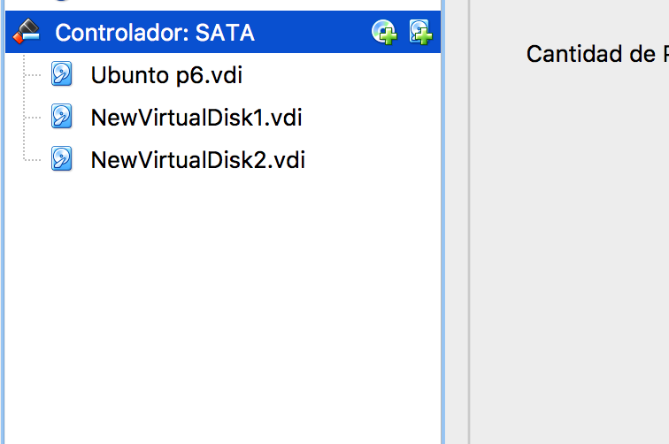
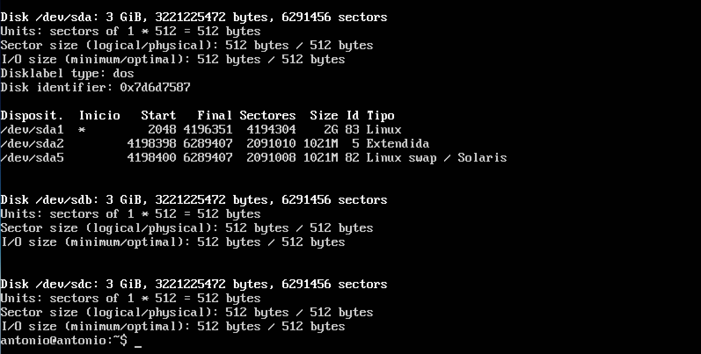
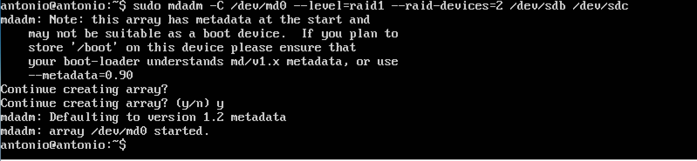
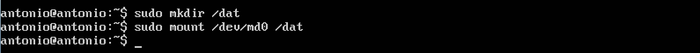
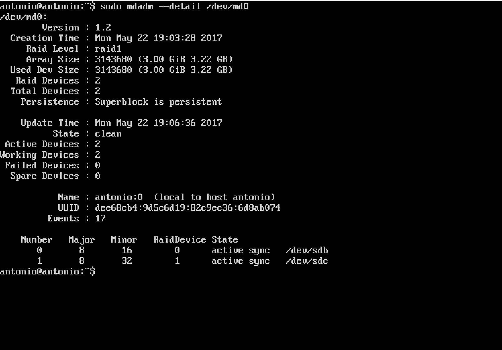
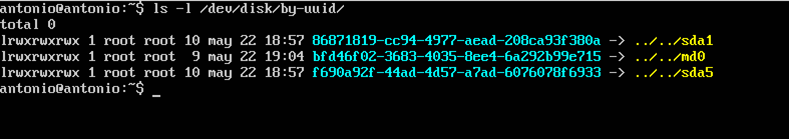
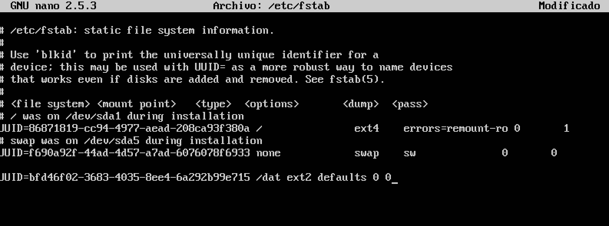
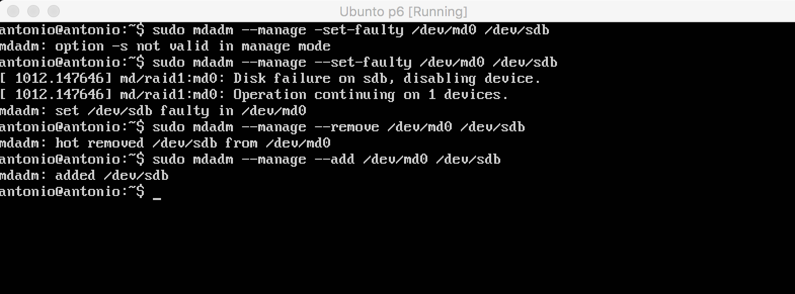

# Discos en RAID.

Para esta práctica he creado una nueva máquina virtual con 3 gb de capacidad.

A continuación añado dos discos duros de 3 gb.

Instalamos el RAID por software:

    sudo apt-get update
    sudo apt-get install mdadm -y

Utilizando

    sudo fdisk -l

obtenemos información del almacenamiento del sistema.

Ahora creamos el Raid con los dos discos duros

    sudo mdadm -C /dev/md0 --level=raid1 --raid-devices=2 /dev/sdb /dev/sdc

Le damos formato con la orden:

    sudo mkfs /dev/md0

Ahora podemos crear el directorio donde se montará el RAID.

    sudo mkdir /dat
    sudo mount /dev/md0 /dat

Para comprobar el estado del raid:

    sudo mdadm --detail /dev/md0

El siguiente paso es obtener el **UUID** de todos los dispositivos de almacenamiento que tenemos, con la orden:

    ls -l /dev/disk/by-uuid/

Añadimos la última linea que vemos en la siguiente captura en el archivo **/etc/fstab**.

Una vez que tenemos el RAID funcionado, provocamos un fallo en el RAID con esta orden:

    sudo mdadm --manage --set-faulty /dev/md0 /dev/sdb

Lo quitamos en caliente:

    sudo mdadm --manage --remove /dev/md0 /dev/sdb

Y volvemos a añadir en "caliente":

    sudo mdadm --manage --add /dev/md0 /dev/sdb

Todo este proceso lo podemos ver en la siguiente captura:

