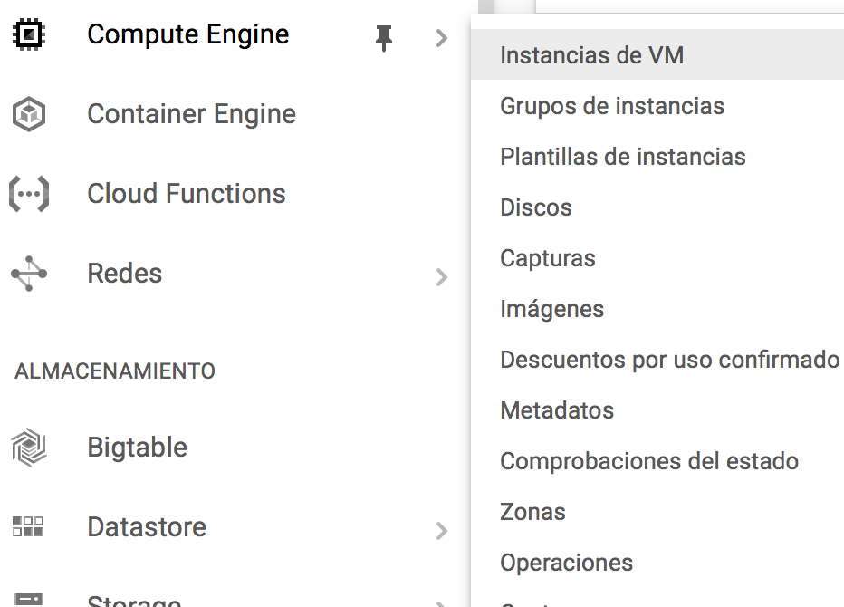
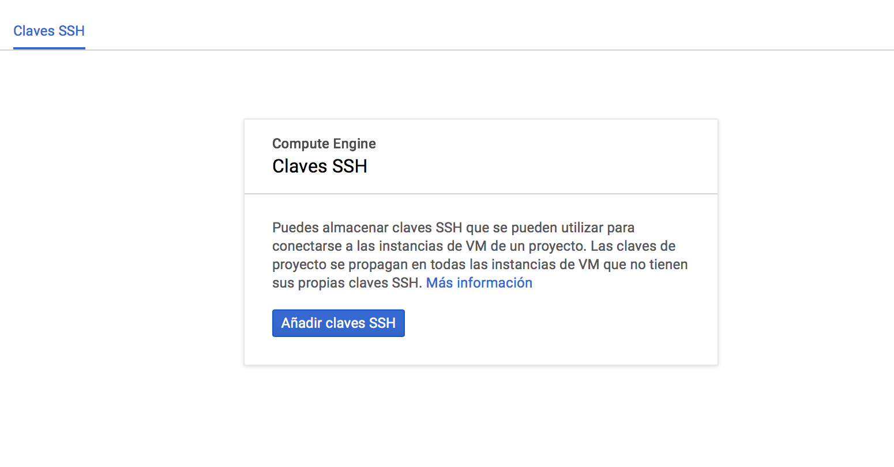
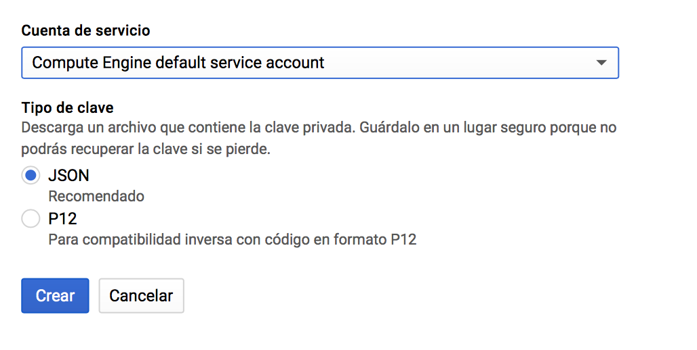
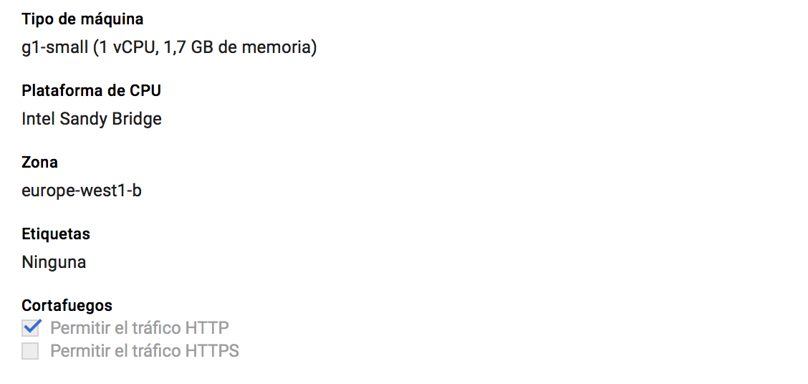
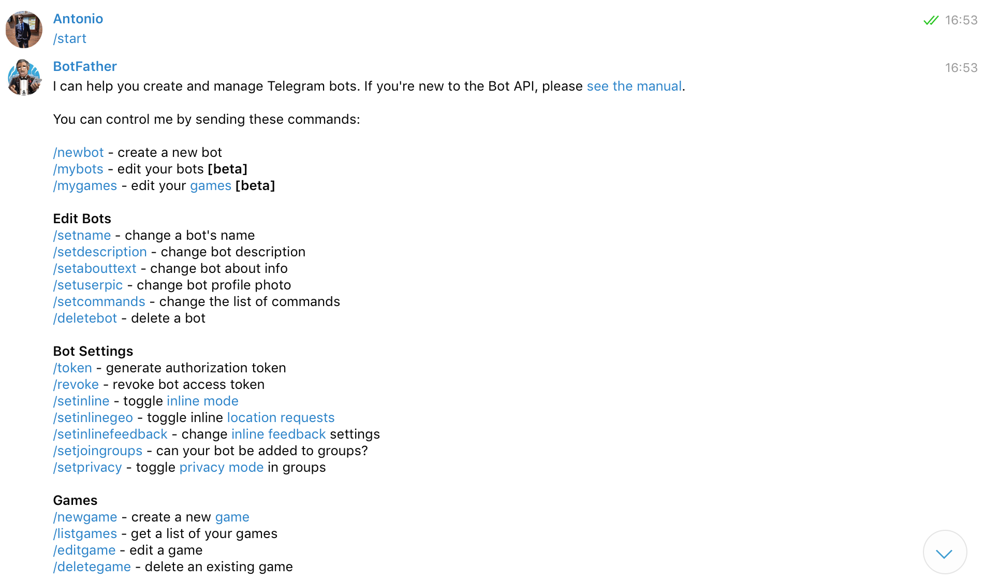
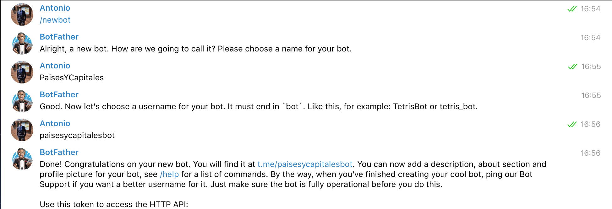

## Despliegue en IaaS-Google Compute Enfine ##

### Herramientas ###

Para realizar el despliegue de una aplicación en el IaaS, debemos de tener instalado:

- [vagrant](https://www.vagrantup.com/downloads.html) que debemos acceder a la página web y descargar el software. Permite generar entornos de desarrollo reproducibles y compartibles de forma muy sencilla.
- [vagrant-google](https://github.com/mitchellh/vagrant-google), este es el plugin para poder desplegar una máquina virtual en el IaaS de Google. Para instalarlo basta con poner en el terminal:
    vagrant plugin install vagrant-google

- pip de python. Esto es necesario para instalar Ansible y Fabric que veremos más adelante.
    sudo easy_install pip

- Ansible es una herramienta open-source que automatiza tareas dentro de nuestra máquina virtual (en este caso nuestro IaaS). Instalación:

    sudo pip install ansible --quiet

- [Fabric](http://www.fabfile.org/installing.html) permite empaquetar, implementar y administrar microservicios escalables y confiables. Instalación:

    sudo pip install fabric

- Clave ssh para poder conectarnos de forma remota al IaaS de google.

### Obtener credenciales ###

Lo primero es acceder a la página de [Google Compute Engine](https://cloud.google.com/compute/) y registrar una cuenta gratuita, en la cual tendremos que ingresar la tarjeta de crédito pero que no nos cobrarán nada hasta pasados 12 meses o consumas los 300 dólares.
El siguiente paso es crear un proyecto, en mi caso lo he llamado **Paises y Capitales**.
Necesitamos introducir la clave pública del ssh en el proyecto, para generar el par de claves ssh introducimos en el terminal:

    ssh-keygen -t rsa -f ~/.ssh/key_cge -C Antkk10

La opción -f indica el nombre del fichero y la opción -C el nombre de usuario de la clave.
Nos dirigimos al panel de control, Compute Engine --> Metadatos --> Claves ssh. Pulsamos el botón añadir ssh y debemos de introducir todo el contenido del archivo key_cge.pub.

Ahora debemos de obtener la id del proyecto, el client email (acabado en gserviceaccount.com) y la clave de cuenta del servicio en formato JSON. Para esto último vamos a credenciales --> Crear credenciales --> Clave de cuenta del servicio
--> JSON y usamos una ruta de archivo seguro.

### Apertura http ###

Para que nuestro bot de Telegram responda a las peticiones de los usuarios necesitamos abrir el http del IaaS. Para esto vamos a Compute Engine --> Instancias de VM. Editamos la instancia que tenemos creada y pulsamos sobre la opción http.

### Obtener bot ###

Para obtener un bot de Telegram he seguido los pasos de este [enlace](https://www.xatakamovil.com/aplicaciones/llegan-los-bots-a-telegram-como-crear-el-tuyo-propio).

1. Introduzco en el buscador de Telegram **BotFather**.
2. Introduzco **/start** en la conversación con dicho bot.
3. Indico que quiero crear un bot **/newbot**.
4. El nombre del bot será **PaisesYCapitales**.
5. El nombre de usuario dle bot es **paisesycapitalesbot**. Importante que acabe en bot.
6. BotFather nos dará un token que debemos de almacenar y que usaremos para que nuestro bot pueda recibir peticiones y contestar a los usuarios.

El proceso que he seguido lo dejo en imágenes.

Obviamente en la última linea de la segunda imagen, justo después nos da el token, que no lo muestro por pantalla.

La funcionalidad del token la muestro en este [enlace](https://github.com/Antkk10/BotPaisesYCapitales/blob/master/bot/paisesycapitalesbot.py). Simplemente responde a **/Start** que nos da la bienvenida y **/Francia** que responde con la capital de dicho país.

El bot no es relevante en este trabajo, ya que lo que quería es que el IaaS funcione correctamente, permitiendo a nuestra aplicación recibir y responder peticiones.

El repositorio del bot dentro de mi cuenta de GitHub es [este](https://github.com/Antkk10/BotPaisesYCapitales).
