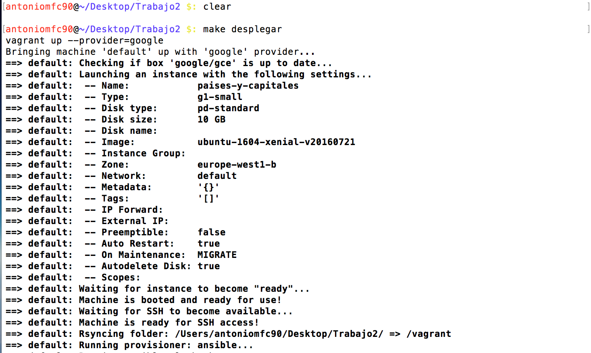
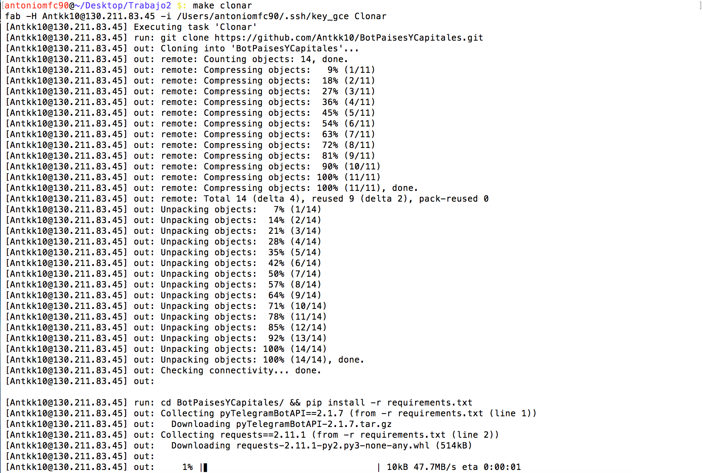
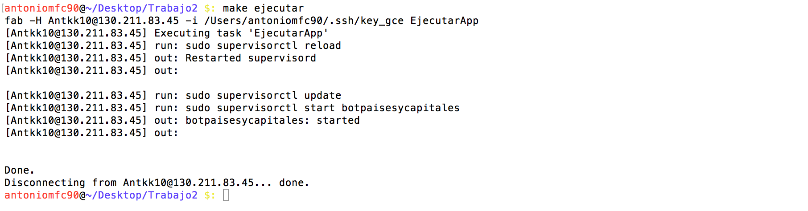
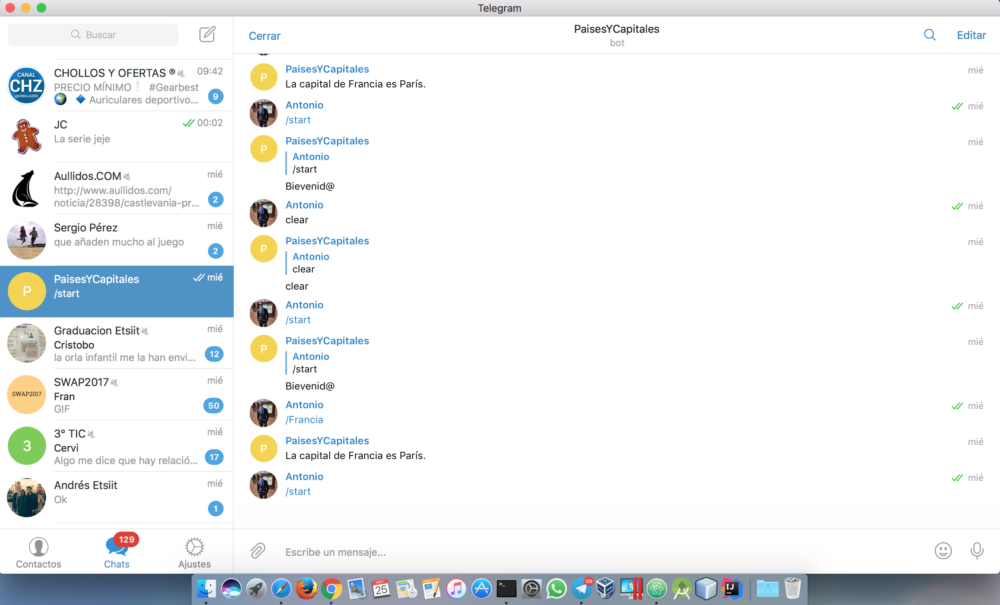

## Despliegue en IaaS-Google Compute Enfine ##

### Herramientas ###

Para realizar el despliegue de una aplicación en el IaaS, debemos de tener instalado:

- [vagrant](https://www.vagrantup.com/downloads.html) que debemos acceder a la página web y descargar el software. Permite generar entornos de desarrollo reproducibles y compartibles de forma muy sencilla.
- [vagrant-google](https://github.com/mitchellh/vagrant-google), este es el plugin para poder desplegar una máquina virtual en el IaaS de Google. Para instalarlo basta con poner en el terminal:
    vagrant plugin install vagrant-google

- pip de python. Esto es necesario para instalar Ansible y Fabric que veremos más adelante.
    sudo easy_install pip

- Ansible es una herramienta open-source que automatiza tareas dentro de nuestra máquina virtual (en este caso nuestro IaaS). Instalación:

    sudo pip install ansible --quiet

- [Fabric](http://www.fabfile.org/installing.html) permite empaquetar, implementar y administrar microservicios escalables y confiables. Instalación:

    sudo pip install fabric

- Clave ssh para poder conectarnos de forma remota al IaaS de google.

### Obtener credenciales ###

Lo primero es acceder a la página de [Google Compute Engine](https://cloud.google.com/compute/) y registrar una cuenta gratuita, en la cual tendremos que ingresar la tarjeta de crédito pero que no nos cobrarán nada hasta pasados 12 meses o consumas los 300 dólares.
El siguiente paso es crear un proyecto, en mi caso lo he llamado **Paises y Capitales**.
Necesitamos introducir la clave pública del ssh en el proyecto, para generar el par de claves ssh introducimos en el terminal:

    ssh-keygen -t rsa -f ~/.ssh/key_cge -C Antkk10

La opción -f indica el nombre del fichero y la opción -C el nombre de usuario de la clave.
Nos dirigimos al panel de control, Compute Engine --> Metadatos --> Claves ssh. Pulsamos el botón añadir ssh y debemos de introducir todo el contenido del archivo key_cge.pub.

Ahora debemos de obtener la id del proyecto, el client email (acabado en gserviceaccount.com) y la clave de cuenta del servicio en formato JSON. Para esto último vamos a credenciales --> Crear credenciales --> Clave de cuenta del servicio
--> JSON y usamos una ruta de archivo seguro.

### Apertura http ###

Para que nuestro bot de Telegram responda a las peticiones de los usuarios necesitamos abrir el http del IaaS. Para esto vamos a Compute Engine --> Instancias de VM. Editamos la instancia que tenemos creada y pulsamos sobre la opción http.

### Obtener bot ###

Para obtener un bot de Telegram he seguido los pasos de este [enlace](https://www.xatakamovil.com/aplicaciones/llegan-los-bots-a-telegram-como-crear-el-tuyo-propio).

1. Introduzco en el buscador de Telegram **BotFather**.
2. Introduzco **/start** en la conversación con dicho bot.
3. Indico que quiero crear un bot **/newbot**.
4. El nombre del bot será **PaisesYCapitales**.
5. El nombre de usuario dle bot es **paisesycapitalesbot**. Importante que acabe en bot.
6. BotFather nos dará un token que debemos de almacenar y que usaremos para que nuestro bot pueda recibir peticiones y contestar a los usuarios.

El proceso que he seguido lo dejo en imágenes.

Obviamente en la última linea de la segunda imagen, justo después nos da el token, que no lo muestro por pantalla.

La funcionalidad del token la muestro en este [enlace](https://github.com/Antkk10/BotPaisesYCapitales/blob/master/bot/paisesycapitalesbot.py). Simplemente responde a **/Start** que nos da la bienvenida y **/Francia** que responde con la capital de dicho país.

El bot no es relevante en este trabajo, ya que lo que quería es que el IaaS funcione correctamente, permitiendo a nuestra aplicación recibir y responder peticiones.

El repositorio del bot dentro de mi cuenta de GitHub es [este](https://github.com/Antkk10/BotPaisesYCapitales).

### Pasos previos al despligue ###
Primero debemos de guardar las credenciales que obtuvimos anteriormente. Para ello en el terminal debemos de poner:

    export PROJECT_ID=Nuestro_id_del_proyecto
    export CLIENT_EMAIL=Email_que_obtuvimos
    export KEY_LOCATION=ruta_fichero_json

#### Vagranfile ####

El despliegue lo he hecho con las herramientas mencionadas al principio del documento. Lo primero que debemos hacer es crear el archivo **Vagrantfile**. Esto es necesario para poder realizar el despliegue de nuestra máquina virtual en la nube. En este archivo indicamos todo lo necesario que debe de tener nuestra máquina, y su contenido es el siguiente:

    Vagrant.configure('2') do |config|
      config.vm.box = 'google/gce' # Indicamos el tipo de caja

      config.vm.provider :google do |google, override|

        # each of the below values will default to use the env vars named as below if not specified explicitly
        google.google_project_id = ENV['PROJECT_ID']
        google.google_client_email = ENV['CLIENT_EMAIL']
        google.google_json_key_location = ENV['KEY_LOCATION']

        # Indicamos el SO en gce.
        google.image = 'ubuntu-1604-xenial-v20160721'
        google.zone = 'europe-west1-b' # Localización
        google.name = 'paises-y-capitales'
        google.machine_type='g1-small'

        # ssh
        config.ssh.username = 'Antkk10'
        config.ssh.private_key_path ='/Users/antoniomfc90/.ssh/key_gce'

      end

      #Provisionamiento
      config.vm.provision "ansible" do |ansible|
          ansible.sudo = true
          ansible.playbook = "playbock.yml"
          ansible.verbose = "v"
          ansible.host_key_checking = false
        end

    end

Lo primero que ponemos es el nombre de la caja, **google/gce**.
Dentro de la configuración del proveedor (Google), debemos de indicar las credenciales que hemos obtenido para poder conectarnos. Después indicamos la configuración de la máquina (estos datos los vemos en la instancia de la página web).

Por último indicamos el nombre y el fichero con la clave privada ssh.
También tenemos la opción de configurar dentro de Vagranfile la ruta del fichero de ansible para provisionamiento de la máquina y que posteriormente mencionaré más adelante. Lo importante de esas lineas de código es que indicamos el fichero que tiene todo el contenido para provisionar la instancia.

#### Ansible ####

Para provisionar la máquina la podemos hacer de dos formas.

1. La primera forma que se me ocurre es acceder por ssh a la instancia creada y ir introduciendo:

    sudo apt update
    sudo apt install -y ....

2. La segunda opción es indicar en el fichero **playbock.yml** que usa ansible, todas las herramientas y servicios que se tienen que instalar en la máquina sin necesidad de acceder remotamente. Además de instalar los archivos, nos muestra por pantalla los posibles errores que puedan surgir durante la instalación.

Yo he usado la segunda opción y considero que es la mejor ya que puedes instalar todo lo que necesitas antes de acceder a la máquina virtual.

El contenido de **playbock.yml** es el siguiente:

    - hosts: all
      sudo: yes
      remote_user: Antkk10
      vars:
        TOKENBOT: "{{ lookup('env','TOKENBOT') }}"
      tasks:
      - name: Actualizar
        command: sudo apt-get update
      - name: Instalar setuptools python
        apt: name=python-setuptools state=present
      - name: Instalar python-dev
        apt: name=python-dev state=present
      - name: Instalar libpq-dev python
        apt: name=libpq-dev state=present
      - name: Instalar build-essential python
        apt: name=build-essential state=present
      - name: Instalar python-psycopg2
        apt: name=python-psycopg2 state=present
      - name: Instalar git
        apt: name=git state=present
      - name: Instalar pip
        apt: name=python-pip state=present
      - name: Instalamos la API del bot
        command: sudo pip install python-telegram-bot
      - name: Instalamos flud para el supervisor
        command: sudo pip install flup
      - name: Instalar supervisor
        command: sudo apt-get install -y supervisor
      - name: Configura programa para supervisor
        template: src=supervisorbot.conf dest=/etc/supervisor/conf.d/supervisorbot.conf
      - name: Ejecutar supervisor
        service: name=supervisor state=started

Como podemos ver, indicamos el nombre de usuario y la opción de sudo. Introducimos la variable de entorno del token del bot para que esté almacenada en el sistema.
Todo lo demás simula el típico **sudo apt install -y ...** que solemos hacer para instalar herramientas o servicios en Unix.

#### Fabric ####

Fabric nos permite ejecutar ordenes de forma remota dentro de la máquina virtual. Mi archivo **fabfile.py** tiene este contenido:

    # coding: utf-8

    from fabric.api import sudo, cd, env, run, shell_env
    import os

    def Clonar():
        """ Descarga el repositorio. """
        run('git clone https://github.com/Antkk10/BotPaisesYCapitales.git')
        run('cd BotPaisesYCapitales/ && pip install -r requirements.txt')

    def EjecutarApp():
        """ Función para ejecutar el Bot. """
        with shell_env(TOKENBOT=os.environ['TOKENBOT']):
            run('sudo supervisorctl reload')
            run('sudo supervisorctl update')
            run('sudo supervisorctl start botpaisesycapitales')

    def StopApp():
        """ Función que para el bot. """
        run('sudo supervisorctl stop botpaisesycapitales')

    def borrar():
        run('rm -Rf BotPaisesYCapitales/')

Contiene ordenes que se ejecutarán dentro de la instancia como clonar el repositorio del bot, ejecutar el supervisor sobre el ejecutable, para el supervisor y borrar el código del bot.

#### Supervisor ####
He instalado el servicio **supervisor** dentro de la instancia para que esté ejecutando en todo el archivo **paisesycapitalesbot.py**. Esto es necesario para que el bot esté disponible las 24 horas en todo momento. Para que el supervisor funcione correctamente debemos crear un archivo de configuración, que en para el caso del bot es el siguiente:

    [program: botpaisesycapitales]
    autostart=false
    command=python paisesycapitalesbot.py
    user=Antkk10
    directory=/home/Antkk10/BotPaisesYCapitales/bot
    environment= TOKENBOT="{{TOKENBOT}}"
    redirect_stderr=true
    stdout_logfile=/var/log/supervisor/botpaisesycapitales.log
    stderr_logfile=/var/log/supervisor/botpaisesycapitales-error.log

- Identificador: **botpaisesycapitales**.
- Autostart a false.
- El comando que ejecuta siempre el supervisor es **python paisesycapitalesbot.py**
- El nombre de usuario es **Antkk10**.
- El directorio donde está el archivo .py es **/home/Antkk10/BotPaisesYCapitales/bot**.
- Usa el token del bot de la variable de entorno.
- Por último indicamos donde almacena toda la información de la ejecución del bot.

Tengo que comentar que normalmente el supervisor funciona con **sudo supervisorctl start botpaisesycapitales**, sin embargo con la instancia he tenido problemas, por lo tanto antes de iniciar la supervisión, he tenido que ejecutar **sudo supervisorctl reload** y después **sudo supervisorctl reload**. Todo esta información la he encontrado en [stackoverflow](https://stackoverflow.com).

#### Makefile ####

He creado un makefile para que el despliegue, aprovisionamiento y todas las ordenes que se ejecutan sobre la instancia sean mucho más sencillas. El contenido del makefile es el siguiente:

    desplegar:
    		vagrant up --provider=google

    provisionar:
    		vagrant provision

    clonar:
    		fab -H Antkk10@130.211.83.45 -i /Users/antoniomfc90/.ssh/key_gce Clonar

    ejecutar:
    		fab -H Antkk10@130.211.83.45 -i /Users/antoniomfc90/.ssh/key_gce EjecutarApp

    stop:
    		fab -H Antkk10@130.211.83.45 -i /Users/antoniomfc90/.ssh/key_gce StopApp

    destruir:
    		vagrant destroy -f

    borrar:
    		fab -H Antkk10@130.211.83.45 -i /Users/antoniomfc90/.ssh/key_gce borrar

Para algunos casos es mucho más sencillo de recordar y de introducir en el terminal si pongo:

    make ejecutar

que

    fab -H Antkk10@130.211.83.45 -i /Users/antoniomfc90/.ssh/key_gce EjecutarApp

así si necesito hacer modificaciones o simplemente necesito ejecutar la aplicación muchas veces a lo largo del día, el proceso es mucho más sencillo.

### Despliegue ###

Una vez que tenemos todos los archivos creados, nos situamos en la carpeta donde están todos ellos y ejecutamos:

    make desplegar

Esta orden se traduce en

    vagrant up --provider=google

que es el comando con el que se debe de desplegar la máquina en el IaaS.

Después del despliegue normalmente suele hacerse el provisionamiento sin indicar nada. Para asegurarnos de que se provisiona la máquina introducimos:

    make provisionar

que equivale a

    vagrant provision

Estas dos órdenses son las más sencillas de ejecutar. Donde tiene más sentido es a la hora de usar fabric y el proceso para instalar y ejecutar la aplicación sería el siguiente:

    make clonar
    make ejecutar

Una vez que tenemos la aplicación en funcionamiento podemos ver que responde a nuestras peticiones.

